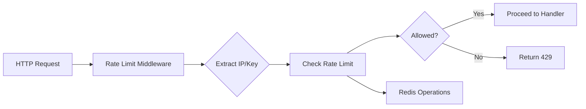

# Distributed Rate Limiter 
(Boiler plate generated //TODO: update later) 

A high-performance, distributed rate limiter built with Go, designed for microservices and API gateways. Implements token bucket algorithm with Redis backend, featuring clean architecture, dependency injection, and comprehensive error handling.

[](https://golang.org)

## Overview

This project demonstrates production-grade Go development practices while solving distributed rate limiting challenges. The system prevents API abuse through token bucket rate limiting across multiple service instances, with Redis providing the distributed state store.

**Key Features:**
- **Distributed**: Scales across multiple instances with Redis coordination
- **Configurable**: Environment-based configuration with validation
- **Observable**: Structured logging with instance identification
- **Performant**: Minimal overhead with efficient Redis operations
- **Extensible**: Plugin architecture for different rate limiting strategies

## Architecture

### Clean Architecture Principles

```
cmd/server/           # Application entry point
├── main.go          # Bootstrap and dependency injection

internal/
├── config/          # Configuration management
├── server/          # HTTP server setup
├── middlewares/     # HTTP middleware chain
├── ratelimiter/     # Rate limiting abstractions
│   └── redis/       # Redis-based implementations
├── redis/           # Redis client wrapper
└── http/            # HTTP handlers
```

### Design Patterns

**Dependency Injection:**
- Constructor injection for all dependencies
- Interface-based design enabling testability
- Clean separation of concerns

**Factory Pattern:**
- Strategy-based rate limiter creation
- Extensible algorithm implementations
- Configuration-driven instantiation

**Middleware Chain:**
- Composable HTTP middleware
- Clean request/response flow
- Cross-cutting concerns (logging, rate limiting)

**Adapter Pattern:**
- Redis client abstraction
- External dependency isolation
- Test-friendly interfaces

### Rate Limiting Flow



## 🚀 Quick Start

### Prerequisites
- Docker & Docker Compose
- Go 1.24.5+ (for development)

### Run with Docker Compose

```bash
# Clone and navigate to project
git clone <repository>
cd distributed-rate-limiter

# Start all services
docker-compose up --build

# Test rate limiting
curl http://localhost/api
hey -n 50 -c 10 http://localhost/api
```

### Local Development

```bash
# Install dependencies
go mod download

# Run Redis
docker run -d -p 6379:6379 redis:7-alpine

# Set environment variables
export PORT=1783
export LIMITER_CAPACITY=20
export LIMITER_REFILL_RATE=5
export REDIS_ADDR=localhost:6379

# Run the server
go run cmd/server/main.go
```

## ⚙️ Configuration

Environment-based configuration with validation:

| Variable | Default | Description |
|----------|---------|-------------|
| `PORT` | `1783` | HTTP server port |
| `LIMITER_STRATEGY` | `tokenbucket` | Rate limiting algorithm |
| `LIMITER_CAPACITY` | `20` | Token bucket capacity |
| `LIMITER_REFILL_RATE` | `5` | Tokens added per second |
| `REDIS_ADDR` | `localhost:6379` | Redis connection address |
| `REDIS_PASSWORD` | `""` | Redis password |
| `REDIS_DB` | `0` | Redis database number |
| `REDIS_POOL_SIZE` | `20` | Redis connection pool size |

## 🔧 Go Best Practices Demonstrated

### Idiomatic Go

**Project Structure:**
- `internal/` package for private APIs
- Clear package naming and organization
- Single responsibility principle

**Error Handling:**
- Error wrapping with context (`fmt.Errorf("failed: %w", err)`)
- Structured error propagation
- Graceful degradation

**Concurrency:**
- Context-aware operations
- Proper resource cleanup
- Thread-safe Redis operations

### Performance Optimizations

**Redis Efficiency:**
- Connection pooling with configurable size
- Hash-based storage for atomic field operations
- Minimal network round-trips

**Memory Management:**
- Efficient string parsing
- Minimal allocations in hot paths
- Proper resource lifecycle management

### Dependency Management

**Minimal External Dependencies:**
- Only Redis client (`github.com/redis/go-redis/v9`)
- No additional frameworks or libraries
- Standard library heavy for core functionality

**Clean Interfaces:**
```go
type RateLimiter interface {
    CheckLimit(ctx context.Context, key string) (allowed bool, remaining int, err error)
}
```

## 📊 API Endpoints

### GET /api
Rate-limited endpoint returning JSON response.

**Response:**
```json
{
  "msg": "Successfully Hit",
  "time": "2024-01-01T12:00:00Z",
  "instanceId": "instance-123"
}
```

**Rate Limit Headers:**
- `X-RateLimit-Remaining`: Tokens remaining in bucket

### GET /health
Health check endpoint.

## 🧪 Testing & Quality

### Current Test Coverage
- [ ] Unit tests for rate limiting logic
- [ ] Integration tests with Redis
- [ ] Load testing scenarios
- [ ] Race condition verification tests

### Planned Enhancements
- [ ] Custom error types with structured error codes
- [ ] Log aggregation to database
- [ ] Metrics collection and monitoring
- [ ] Configuration validation improvements

## 🔍 Implementation Details

### Token Bucket Algorithm

The token bucket algorithm provides smooth rate limiting:

- **Capacity**: Maximum burst allowance
- **Refill Rate**: Tokens added per second
- **Distributed State**: Redis maintains consistent state across instances

### Race Condition Analysis

See [`internal/ratelimiter/redis/README.md`](internal/ratelimiter/redis/README.md) for detailed analysis of concurrency issues and evolution toward atomic implementations.

### IP Extraction Strategy

Intelligent client IP detection:
1. `X-Forwarded-For` header (first IP in chain)
2. `RemoteAddr` fallback
3. Proper IPv4/IPv6 handling

## 🔄 Development Workflow

```bash
# Run tests
go test ./...

# Run with race detection
go run -race cmd/server/main.go

# Format code
go fmt ./...

# Lint code
go vet ./...

# Build for production
go build -o bin/server cmd/server/main.go
```

## 🚢 Deployment

### Docker Production Build

```dockerfile
FROM golang:1.24-alpine AS builder
WORKDIR /app
COPY . .
RUN go build -o server ./cmd/server

FROM alpine:latest
COPY --from=builder /app/server .
CMD ["./server"]
```

### Kubernetes Deployment

The stateless design makes this perfect for Kubernetes:
- Horizontal pod autoscaling
- ConfigMap for environment variables
- Redis service for state coordination

## 📈 Performance Benchmarks

**Target Metrics:**
- < 1ms average response time
- 99th percentile < 5ms
- Support 10k+ RPS per instance

**Current Implementation:**
- Redis hash operations: ~0.5ms
- Token calculation: ~0.1ms
- Network overhead: ~0.5ms

## 📚 Learnings & Patterns

This project demonstrates:

- **Clean Architecture** in Go microservices
- **Distributed Systems** coordination patterns
- **Performance Optimization** techniques
- **Testing Strategies** for concurrent systems
- **DevOps Integration** with Docker/Kubernetes

## 🔗 Related Documentation

- [Redis Implementation Details](internal/ratelimiter/redis/README.md)
- [Race Condition Analysis](internal/ratelimiter/redis/race_condition_analysis.md)
- [API Documentation](docs/api.md)

---

**Built with ❤️ and Go best practices**
