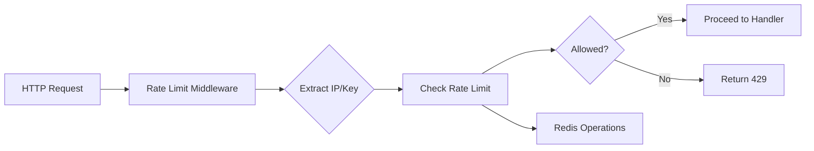

# Distributed Rate Limiter

Production-grade distributed rate limiter built with Go and Redis. Implements token bucket algorithm with multiple strategies for microservices and API gateways.

[](https://golang.org)

## Features

- **Distributed State Management**: Redis-backed coordination across multiple service instances
- **Multiple Token Bucket Implementations**: Hash-based, transaction-based, and Lua script-based strategies
- **Zero Race Conditions**: Lua implementation provides atomic operations with precise refill calculations
- **Extensible Architecture**: Factory pattern enables pluggable rate limiting strategies
- **Clean Separation of Concerns**: Interface-based design with dependency injection
- **Graceful Shutdown**: Proper resource cleanup and connection management
- **Structured Logging**: Instance-aware logging for distributed debugging
- **Environment-Driven Configuration**: Validation and type-safe configuration management

## Architecture

### Clean Architecture Principles

```
cmd/server/           # Application entry point
├── main.go          # Bootstrap and dependency injection

internal/
├── config/          # Configuration management
├── server/          # HTTP server setup and routing
├── middlewares/     # HTTP middleware chain
├── ratelimiter/     # Rate limiting abstractions
│   ├── limiter.go   # RateLimiter interface
│   └── redis/       # Redis-based implementations
│       ├── factory.go           # Rate limiter factory
│       └── tokenbucket/         # Token bucket implementations
│           ├── config.go        # Token bucket configuration
│           ├── hash.go          # Hash-based (has race conditions)
│           ├── transaction.go   # Transaction-based (atomic)
│           ├── lua.go           # Lua script-based (recommended)
│           └── README.md        # Implementation comparison
├── redis/           # Redis client wrapper
└── http/            # HTTP handlers
```

### Design Patterns

- **Factory Pattern**: Strategy-based rate limiter instantiation with configuration-driven selection
- **Dependency Injection**: Constructor injection throughout, enabling testability and loose coupling
- **Middleware Chain**: Composable HTTP middleware for cross-cutting concerns
- **Adapter Pattern**: Redis client abstraction isolating external dependencies

### Implementation Highlights

**Idiomatic Go:**
- `internal/` package for encapsulation
- Error wrapping with context preservation
- Context-aware operations throughout
- Proper resource lifecycle management

**Redis Optimization:**
- Connection pooling with configurable parameters
- Single atomic operation per rate limit check (Lua strategy)
- Hash-based storage minimizing network round-trips

**Minimal Dependencies:**
- Single external dependency: `github.com/redis/go-redis/v9`
- Standard library for core functionality

### Rate Limiting Flow



## API Endpoints

### GET /api
Rate-limited endpoint demonstrating token bucket behavior.

**Response:**
```json
{
  "msg": "Successfully Hit",
  "time": "2024-01-01T12:00:00Z",
  "instanceId": "instance-123"
}
```

**Rate Limit Headers:**
- `X-RateLimit-Remaining`: Tokens remaining in bucket

**Status Codes:**
- `200`: Request allowed
- `429`: Rate limit exceeded

### GET /health
Health check endpoint for load balancer integration.

## Rate Limiting Strategies

### Token Bucket Implementations

The system provides three Redis-based token bucket implementations with different trade-offs:

| Strategy | Atomicity | Performance 
|----------|-----------|-------------
| **Lua Script** | Atomic | Highest 
| **Transaction** | Atomic | Medium 
| **Hash-based** | Non-atomic | High 

**Lua Script Strategy (Recommended):**
- Single atomic Redis operation
- Zero race conditions
- Precise refill calculations
- Minimal network overhead

See [Token Bucket Implementation Details](internal/ratelimiter/redis/tokenbucket/README.md) for comprehensive comparison.

### IP Extraction

Client identification with fallback chain:
1. `X-Forwarded-For` header (first IP in chain)
2. `RemoteAddr` fallback
3. IPv4/IPv6 support

## Configuration

Environment-based configuration with validation:

```bash
# Server
PORT

# Redis
REDIS_ADDR # host:port
REDIS_PASSWORD
REDIS_DB
REDIS_POOL_SIZE

# Rate Limiting
LIMITER_STRATEGY  # Options: tokenbucket-hash, tokenbucket-transaction, tokenbucket-lua
LIMITER_CAPACITY
LIMITER_REFILL_RATE
```

**Strategy Selection:** 
***Token Bucket***
- `lua`: Atomic, highest performance
- `transaction`: Atomic with Redis WATCH/MULTI/EXEC
- `hash`: Development only (has race conditions)

The system is designed for easy extension with new rate limiting strategies
## Performance

**Target Metrics:**
- Sub-millisecond average latency
- 99th percentile < 5ms
- 10k+ requests/second per instance

**Lua Strategy Performance:**
- Single atomic Redis operation per check
- Minimal network overhead
- Zero race conditions
- Precise token refill calculations

## Deployment

**Docker Compose:**
```bash
docker-compose up --build --scale 'go=x'
```
- x : number of instances

**Kubernetes Considerations:**
- Horizontal scaling supported via Redis coordination
- Health check endpoint at `/health`
- Graceful shutdown with SIGTERM handling
- Environment-based configuration for 12-factor compliance

## Future Enhancements

### Observability
- **Prometheus Metrics**: Request rates, rate limit hits/misses, Redis latency, token bucket state
- **Distributed Tracing**: OpenTelemetry integration for request flow visualization
- **Structured Logging**: Enhanced context with trace IDs and correlation

### Resilience
- **Circuit Breaker**: Redis failure detection with fallback strategies (fail-open/fail-closed)
- **Retry Logic**: Exponential backoff for transient Redis failures
- **Health Checks**: Redis connectivity monitoring with automatic reconnection

### Testing
- **Unit Tests**: Coverage for all rate limiting strategies
- **Integration Tests**: Redis interaction verification
- **Load Tests**: Performance benchmarking and race condition validation
- **Chaos Engineering**: Redis failure scenario testing

### Additional Features
- **Rate Limit Headers**: `X-RateLimit-Limit`, `X-RateLimit-Reset` for client awareness
- **Custom Error Types**: Structured error codes for improved debugging
- **Hot Configuration Reload**: Dynamic rate limit adjustment without restart
- **Multiple Rate Limit Tiers**: User-based, IP-based, and endpoint-specific limits


---

**Built with ❤️ and Go best practices**

