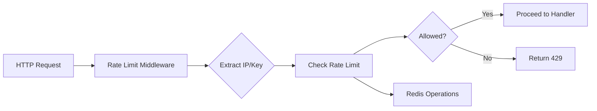

# Distributed Rate Limiter 

A distributed rate limiter built with Go and Redis, implementing token bucket algorithm for microservices and API gateways. Features clean architecture, dependency injection, and extensible design for adding new rate limiting strategies.

[](https://golang.org)

## Overview

This project demonstrates Go development practices for building distributed systems. Implements multiple token bucket algorithms with Redis for distributed rate limiting across multiple service instances.

**Key Features:**
- **Distributed**: Scales across multiple instances with Redis coordination
- **Configurable**: Environment-based configuration with validation
- **Observable**: Structured logging with instance identification
- **Multiple Implementations**: Hash, Transaction, and Lua-based token bucket strategies
- **Production Ready**: Lua implementation recommended for high-performance, race-condition-free rate limiting
- **Extensible**: Factory pattern enables easy addition of new rate limiting strategies

## Architecture

### Clean Architecture Principles

```
cmd/server/           # Application entry point
├── main.go          # Bootstrap and dependency injection

internal/
├── config/          # Configuration management
├── server/          # HTTP server setup and routing
├── middlewares/     # HTTP middleware chain
├── ratelimiter/     # Rate limiting abstractions
│   ├── limiter.go   # RateLimiter interface
│   └── redis/       # Redis-based implementations
│       ├── factory.go           # Rate limiter factory
│       └── tokenbucket/         # Token bucket implementations
│           ├── config.go        # Token bucket configuration
│           ├── hash.go          # Hash-based (has race conditions)
│           ├── transaction.go   # Transaction-based (atomic)
│           ├── lua.go           # Lua script-based (recommended)
│           └── README.md        # Implementation comparison
├── redis/           # Redis client wrapper
└── http/            # HTTP handlers
```

### Design Patterns

**Dependency Injection:**
- Constructor injection for all dependencies
- Interface-based design enabling testability
- Clean separation of concerns

**Factory Pattern:**
- Strategy-based rate limiter creation
- Extensible algorithm implementations
- Configuration-driven instantiation

**Middleware Chain:**
- Composable HTTP middleware
- Clean request/response flow
- Cross-cutting concerns (logging, rate limiting)

**Adapter Pattern:**
- Redis client abstraction
- External dependency isolation
- Test-friendly interfaces

### Idiomatic Go

**Project Structure:**
- `internal/` package for private APIs
- Clear package naming and organization
- Single responsibility principle

**Error Handling:**
- Error wrapping with context (`fmt.Errorf("failed: %w", err)`)
- Structured error propagation
- Graceful degradation

**Concurrency:**
- Context-aware operations
- Proper resource cleanup
- Thread-safe Redis operations

### Performance Optimizations

**Redis Efficiency:**
- Connection pooling with configurable size
- Hash-based storage for atomic field operations
- Minimal network round-trips

**Memory Management:**
- Efficient string parsing
- Minimal allocations in hot paths
- Proper resource lifecycle management

### Dependency Management

**Minimal External Dependencies:**
- Only Redis client (`github.com/redis/go-redis/v9`)
- No additional frameworks or libraries
- Standard library heavy for core functionality

### Rate Limiting Flow



## API Endpoints

### GET /api
Rate-limited endpoint returning JSON response.

**Response:**
```json
{
  "msg": "Successfully Hit",
  "time": "2024-01-01T12:00:00Z",
  "instanceId": "instance-123"
}
```

**Rate Limit Headers:**
- `X-RateLimit-Remaining`: Tokens remaining in bucket

### GET /health
Health check endpoint.

## Testing & Quality

### Current Test Coverage
- [ ] Unit tests for all rate limiting implementations (hash, transaction, lua)
- [ ] Integration tests with Redis for each strategy
- [ ] Load testing scenarios comparing implementation performance
- [ ] Race condition verification tests (hash vs atomic implementations)

### Implementation Status
- [x] **Hash-based token bucket** - Basic implementation with known race conditions
- [x] **Transaction-based token bucket** - Atomic operations with Redis transactions
- [x] **Lua script-based token bucket** - Production-ready with best performance
- [ ] Custom error types with structured error codes
- [ ] Rate limit statistics logging to database
- [ ] Code refinements and optimizations
- [ ] Circuit breaker pattern for Redis resilience
- [ ] Comprehensive rate limit headers
- [x] **Graceful shutdown implementation** - Close connections and shut down cleanly
- [ ] Metrics collection and monitoring
- [ ] Configuration validation improvements
- [ ] Hot Reloading

### Planned Enhancements

**Custom Error Types:**
- Structured error codes for different failure scenarios
- Better error classification (configuration, Redis connectivity, rate limiting)
- Enhanced debugging and monitoring capabilities

**Rate Limit Statistics Logging:**
- Log successful/failed requests with metadata (IP, user agent, endpoint)
- Periodic aggregation of rate limit events to database
- Analytics dashboard for traffic patterns and abuse detection

**Code Refinements:**
- Performance optimizations in hot paths
- Memory usage improvements and object pooling
- Enhanced Redis connection management and health checks
- Better configuration validation with detailed error messages

**Additional Enhancements:**
- Circuit breaker pattern for Redis failure resilience
- Comprehensive rate limit headers (X-RateLimit-Reset, X-RateLimit-Limit)
- Graceful shutdown with proper cleanup
- Configuration hot reload without service restart

## Rate Limiting Strategies

### Token Bucket Algorithm

The current implementation uses the **token bucket algorithm** for smooth rate limiting with configurable capacity and refill rates. The algorithm maintains distributed state in Redis for consistent behavior across multiple service instances.

### Strategy Extensibility

The system is designed for easy extension with new rate limiting strategies:

- **Current**: Token bucket with multiple Redis-based implementations
- **Extensible**: Factory pattern allows adding sliding window, leaky bucket, or custom algorithms
- **Interface-based**: Clean abstraction enables strategy swapping without middleware changes

See [`Observations`](internal/ratelimiter/redis/tokenbucket/README.md) for detailed implementation comparison and performance characteristics.

### IP Extraction Strategy

Intelligent client IP detection:
1. `X-Forwarded-For` header (first IP in chain)
2. `RemoteAddr` fallback
3. Proper IPv4/IPv6 handling

## Performance Benchmarks

**Target Metrics:**
- < 1ms average response time
- 99th percentile < 5ms
- Support 10k+ RPS per instance

**Current Implementation:**
- Lua script-based token bucket (recommended for production)
- Single atomic Redis operation per rate limit check
- Race-condition-free with precise refill calculations
- Hash-based and transaction-based alternatives available

## Learnings & Patterns

This project demonstrates:

- **Clean Architecture** with proper separation of concerns
- **Dependency Injection** for testable code
- **Factory Pattern** for extensible algorithm implementations
- **Strategy Pattern** with multiple token bucket implementations
- **Middleware Pattern** for composable HTTP handling
- **Interface-based Design** for maintainable code
- **Race Condition Solutions** comparing hash, transaction, and Lua approaches

## 🔗 Related Documentation

- [Token Bucket Implementation Details](internal/ratelimiter/redis/tokenbucket/README.md)
- [Redis Client Documentation](internal/redis/client.go)

---

**Built with ❤️ and Go best practices**

