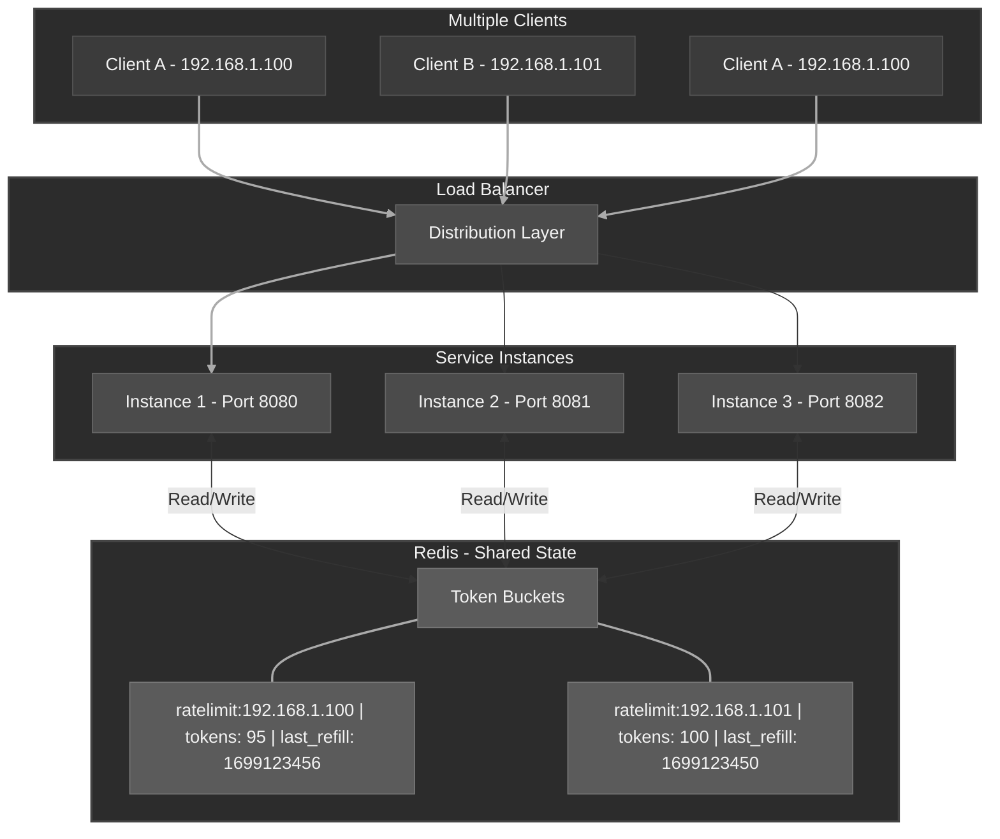

# Distributed Rate Limiter

A distributed rate limiter built with Go and Redis, implementing the token bucket algorithm with multiple strategies for coordinating rate limits across service instances.

[](https://golang.org)

# Quick Start
```bash
git clone https://github.com/brutally-Honest/distributed-rate-limiter.git
cd distributed-rate-limiter
docker-compose up --build --scale 'go=3' # Tune based on requirements 
curl -v http://localhost/api
```

## Overview

When running multiple instances of a service, each instance needs to share rate limit state to prevent a single user from bypassing limits by hitting different servers. This project solves that by using Redis as shared storage, with three token bucket implementations that trade off atomicity and performance.

## Features

- **Distributed State Management**: Redis-backed coordination across multiple service instances
- **Multiple Token Bucket Implementations**: Hash-based, transaction-based, and Lua script-based strategies
- **Atomic Operations**: Lua and Redis Transaction strategies eliminate race conditions
- **Extensible Architecture**: Factory pattern enables pluggable rate limiting strategies
- **Clean Separation of Concerns**: Interface-based design with dependency injection
- **Structured Logging**: Instance-aware logging for distributed debugging
- **Environment-Driven Configuration**: Validation and type-safe configuration management

## Architecture

### Distributed Coordination



### How It Works

1.  **Request arrives** → Middleware extracts client identifier (IP address)
2.  **Strategy executes** → Selected implementation (Hash/Transaction/Lua) checks Redis
3.  **Token bucket logic** → Read current tokens, calculate refill, check availability, update state
4.  **Decision** → Allow request (200 + headers) or reject (429 rate limited)

### Project Structure

```
cmd/server/           # Application entry point
├── main.go          # Bootstrap and dependency injection

internal/
├── config/          # Configuration management
├── server/          # HTTP server setup and routing
├── middlewares/     # HTTP middleware chain
├── ratelimiter/     # Rate limiting abstractions
│   ├── limiter.go   # RateLimiter interface
│   └── redis/       # Redis-based implementations
│       ├── factory.go           # Rate limiter factory
│       └── tokenbucket/         # Token bucket implementations
│           ├── config.go        # Token bucket configuration
│           ├── hash.go          # Hash-based (has race conditions)
│           ├── transaction.go   # Transaction-based (atomic)
│           ├── lua.go           # Lua script-based (recommended)
│           └── README.md        # Implementation comparison
├── redis/           # Redis client wrapper
└── http/            # HTTP handlers
```

### Implementation Highlights

**Design Patterns**

- **Factory Pattern**: Strategy-based rate limiter instantiation with configuration-driven selection
- **Dependency Injection**: Constructor injection throughout, enabling testability and loose coupling
- **Middleware Chain**: Composable HTTP middleware for cross-cutting concerns
- **Adapter Pattern**: Redis client abstraction isolating external dependencies

**Idiomatic Go:**

- `internal/` package for encapsulation
- Error wrapping with context preservation
- Context-aware operations throughout
- Proper resource lifecycle management

**Redis Optimization:**

- Connection pooling with configurable parameters
- Single atomic operation per rate limit check (Lua strategy)
- Hash-based storage minimizing network round-trips

**Minimal Dependencies:**

- Single external dependency: `github.com/redis/go-redis/v9`
- Standard library for core functionality

## API Endpoints

### 1. Rate-Limit Endpoint

```bash
GET /api
```

**Success Response (200):**

```json
{
  "msg": "Successfully Hit",
  "time": "2025-11-09T11:37:54+05:30",
  "instanceId": "46950-059eff"
}
```

**Rate Limited Response (429):**

```json
{
  "error": "Rate limit exceeded"
}
```

**Response Headers:**

- `X-RateLimit-Remaining`: Tokens remaining in bucket

### 2. Health Check Endpoint

```bash
GET /health
```

**Success Response (200):**
```json
{
  "status": "healthy",
  "timestamp": "2025-11-09T11:37:54+05:30",
  "uptime": "44.398377667s",
  "instanceId": "46950-059eff",
  "services": {
    "redis": {
      "status": "connected",
      "latency": "1.2ms"
    }
  }
}
```
**Failed Response (503):**
```json
{
  "status": "unhealthy",
  "timestamp": "2025-11-09T11:37:54+05:30", 
  "uptime": "44.398377667s",
  "instanceId": "46950-059eff",
  "services": {
    "redis": {
      "status": "disconnected",
      "latency": ""
    }
  }
}
```

## Rate Limiting Strategies

### Token Bucket Implementations

The system provides three Redis-based token bucket implementations with different trade-offs:

| Strategy        | Atomicity  | Performance |
| --------------- | ---------- | ----------- |
| **Lua Script**  | Atomic     | Highest     |
| **Transaction** | Atomic     | Medium      |
| **Hash-based**  | Non-atomic | High        |

**Lua Script Strategy (Recommended):**

- Single atomic Redis operation
- Zero race conditions
- Precise refill calculations
- Minimal network overhead

See [Token Bucket Implementation Details](internal/ratelimiter/redis/tokenbucket/README.md) for comprehensive comparison.

## Configuration

Environment-based configuration with validation:

```bash
# Server
PORT=8080

# Redis
REDIS_ADDR=localhost:6379
REDIS_PASSWORD=
REDIS_DB=0
REDIS_POOL_SIZE=10

# Rate Limiting
LIMITER_STRATEGY=tokenbucket-lua  # tokenbucket-lua | tokenbucket-transaction | tokenbucket-hash
LIMITER_CAPACITY=100              # Max tokens in bucket
LIMITER_REFILL_RATE=10            # Tokens added per second
```

**Strategy Selection:**

- `tokenbucket-lua`: Atomic, highest performance (recommended)
- `tokenbucket-transaction`: Atomic with WATCH/MULTI/EXEC
- `tokenbucket-hash`: Non-atomic (development only)

The system is designed for easy extension with new rate limiting strategies

## Running

### Local Development

```bash
# Start Redis
docker run -d -p 6379:6379 redis:alpine

# Run single instance
export PORT=1783

# Desired Redis configuration
export REDIS_ADDR=localhost:6379
export REDIS_PASSWORD=" "

# Desired strategy configuration 
export LIMITER_STRATEGY=tokenbucket-lua  
export LIMITER_CAPACITY=50               
export LIMITER_REFILL_RATE=10

go run cmd/server/main.go
```

### Multiple Instances with Docker Compose

```bash
# Start 3 instances + Redis
docker-compose up --build --scale go=3
```

See [Load Test Observation Details](tests/load/README.md) for comprehensive testing results.

## Future Enhancements

- **Observability**: Prometheus metrics, OpenTelemetry tracing, structured logging with trace IDs
- **Resilience**: Circuit breaker for Redis failures, retry logic with exponential backoff
- **Testing**: Unit, integration tests with race condition validation
- **Enhanced Features**: Additional rate limit headers (`X-RateLimit-Reset`), hot config reload, multi-tier limits (user/IP/endpoint-based)